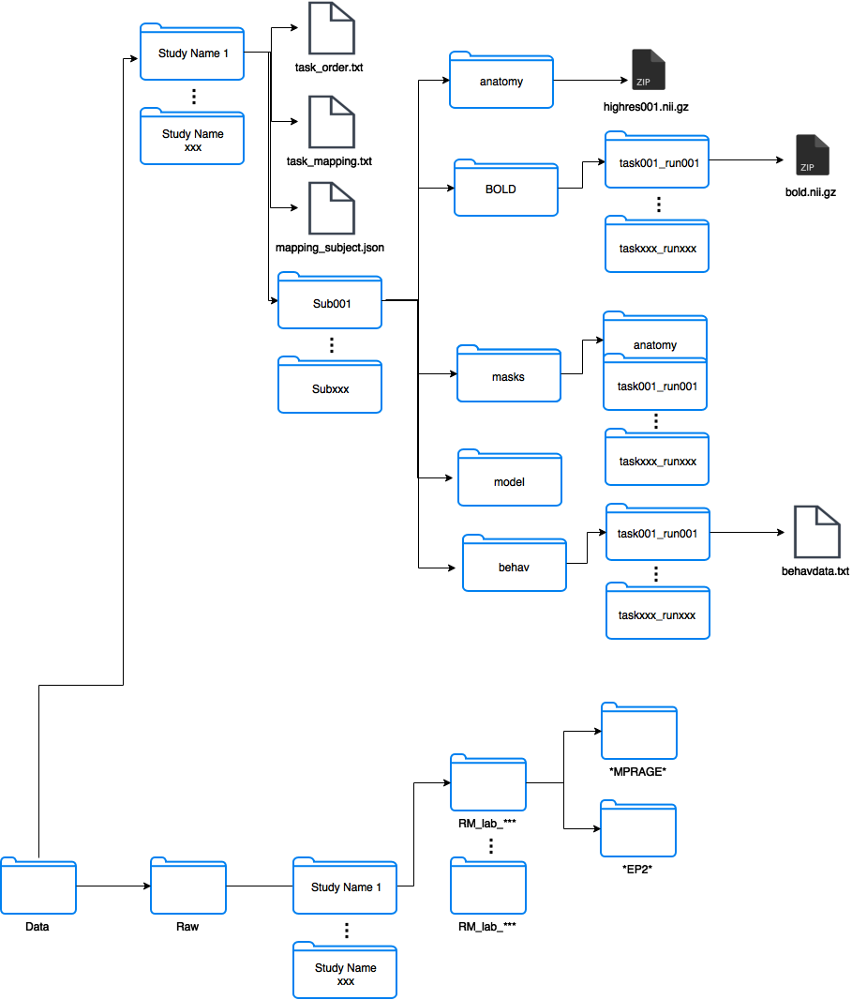

# MVPA Analysis
##Table of Contents

**[Installation Guide](#installation-guide)**

  1. [Nipype Installation](#nipypeinstall)
  2. [Download MVPA Analysis](#downloadmvpaanalysis)

**[OpenFMRI Structure](#openfmri-structure)**

* [Before Creation](#BeforeCreation)
* [After Creation](#AfterCreation)
* [MetaData](#MetaData)

    * [task_order.txt](#task_order)
    * [task_mapping.txt](#task_mapping)
    * [mapping_subject.json](#mapping_subject)

**[Code Design](#CodeDesign)**

* [SubjectDir](#SubjectDir)
* [OpenFMRIData](#OpenFMRIData)

## Installation Guide

1. Follow nipype [installation guide](http://miykael.github.io/nipype-beginner-s-guide/installation.html) or [this one](http://nipy.org/nipype/users/install.html).

2. Download MVPA Analysis
Open the terminal and run

        git clone https://github.com/lshkiller/mvpa_analysis.git

Notes:

- You might run into problems with running FSL in pycharm. Add the following to pycharm.sh (In: [pycharm installation]/bin/pycharm.sh):

        ./etc/fsl/5.0/fsl.sh

## OpenFMRI Structure


### Before Creation

### After Creation

### Metadata

#### Task Order File
    task001_run001
    task001_run002
    task001_run003
    task002_run001
#### Task Mapping File
    MVPA_run1	task001_run001
    MVPA_run2	task001_run001
    MVPA_run3	task001_run001
    MVPA_run4	task001_run001
    MVPA_run5	task002_run001
#### Mapping Subject File
    {"AzOr": 1}

## Code Design
### SubjectDir
 
###### In charge of creating the openfmri structure and converting DICOM files to NIFTY
 
 ```python
     def SubjectDir(subject_code, path, raw_path, behavioural_path, task_order, task_mapping)"
 ```
 
Parameters

- subject_code: The subject code
- path: Output path in openfmri format
- raw_path: Contains the dicom folders
- behavioural_path:
- task_order.txt: List from to task_order.txt
- task_mapping: List from task_mapping.txt

When we initiate the class, it prepares the subject subdirectories as followed:

- Creates BOLD, anatomy, model, masks folders
- Creates BOLD/taskxxx_runxxx
- Creates modelxxx/onsets/taskxxx
- Creates Mask/anatomytaskxxx_runxxx

And converts the DICOM files to NIFTY

If the path exists(we already created the openfmri structure) then we read it and don't overwrite

### OpenFMRIData

###### Holds SubjectDir and loads the subject mapping, task order and task mapping files to the memory
 
```python 
 def OpenFMRIData(data_dir, raw_data_dir, behavioural_dir, study_name):
```

Parameters

- data_dir: Target openfmri directory
- raw_data_dir: Root raw directory (Only the path to the raw directory (in raw/study_name/subxxx))
- behavioural_dir:
- study_name: The name of the study folder containing relevant subjects

```python
 def create_subject_dir(subject_name):
```

Creates the openfmri structure by creating SubjectDir

Parameters

- subname = (string)

Returns:

- SubjectDir Object

```python
 def load_subject_dir(**kwargs):
```

Creates or uses the openfmri structure by creating SubjectDir

- Creates the new directories only when given subname!
- Uses current structure when given subcode/subname and the subject_mapping file exists in the study dir
    
Parameters

- subcode = (number) or subname = (string)

Returns:

- SubjectDir Object